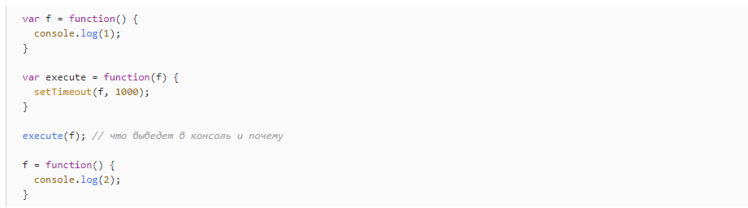
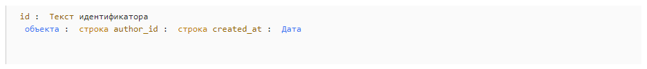

# Junior
## Общие вопросы

1. [Какие методы HTTP-запросов вы знаете?](https://habr.com/ru/post/50147/)
2. [Какие версии HTTP-протокола вам известны?](https://zametkinapolyah.ru/servera-i-protokoly/standarty-http-protokola-istoriya-razvitiya-http-protokola-versii-http-protokola.html)
3. [Какие знают коды ответа (состояния) HTTP?](https://developer.mozilla.org/ru/docs/Web/HTTP/Status)
4. [Что такое Cross-Origin Resource Sharing? Как устранить проблемы с CORS?](https://developer.mozilla.org/ru/docs/Web/HTTP/CORS)
5. [Что такое cookie?](https://ssl.com.ua/blog/what-are-cookies/)
6. [Каков максимальный размер cookie?](https://ask-dev.ru/info/5269/what-is-the-maximum-size-of-a-web-browsers-cookies-key#:~:text=Ключ%20cookie%20используемый%20для%20идентификации,Согласно%20Microsoft%2C%20его%204096%20байт.)
7. [Что означает директива use strict?](https://learn.javascript.ru/strict-mode)
8. [Чем JS отличается при работе на front-end и back-end?](https://timeweb.com/ru/community/articles/frontend-i-backend-razlichiya-osobennosti-i-trebovaniya-k-specialistam)
9. [Что такое статическая и динамическая типизация?](https://tproger.ru/translations/programming-concepts-type-checking/)
10. [Как клиент взаимодействует с сервером?](https://developer.mozilla.org/ru/docs/Learn/Server-side/First_steps/Client-Server_overview)
11. [Что такое REST?](https://systems.education/what-is-rest)
12. [Объясните понятие мутабельность/иммутабельность? Какие типы мутабельны и наоборот?](https://nuancesprog.ru/p/3348/)
13. [Как искать ошибки в коде? Используете ли дебагер?](https://learn.javascript.ru/debugging-chrome)
14. [Какие известные люди из мира JS знаете?](https://techrocks.ru/2018/03/18/influential-javascript-developers/)

## Ядро JS

15. [Какие типы данных существуют в JS?](https://learn.javascript.ru/types)
16. [Как проверить, является ли объект массивом?](https://developer.mozilla.org/ru/docs/Web/JavaScript/Reference/Global_Objects/Array/isArray)
17. [Как проверить, является ли окончательным число?](https://developer.mozilla.org/ru/docs/Web/JavaScript/Reference/Global_Objects/isFinite)
18. [Как проверить, что переменная равна NaN?](https://developer.mozilla.org/ru/docs/Web/JavaScript/Reference/Global_Objects/NaN)
19. [Чем отличается поведение isNaN() и Number.isNaN()?](https://www.jsexpert.net/handbook/javascript/chislo-number/isnan/#:~:text=isNaN%20()%20отличается%20от%20глобальной,не%20относится%20к%20типу%20Number.)
20. [Сравните ключевые слова var, let, const.](https://techrocks.ru/2020/04/07/difference-between-var-let-const/)
21. [Что такое область видимости?](https://habr.com/ru/post/517338/)
22. [Что такое деструктуризация?](https://learn.javascript.ru/destructuring)
23. [Для чего предназначены методы setTimeout и setInterval?](https://learn.javascript.ru/settimeout-setinterval#:~:text=setTimeout%20позволяет%20вызвать%20функцию%20один,вызов%20через%20определённый%20интервал%20времени.)
24. [Сравните подходы к работе с асинхронным кодом: сallbacks vs promises vs async/await.](https://www.loginradius.com/blog/engineering/callback-vs-promises-vs-async-await/)
25. [Можно ли записывать новые свойства/функции в прототипы стандартных классов (Array, Object и т.д.)? Почему нет? В каких случаях это можно делать? Как обезопасить себя, если нужно расширить прототип?](https://learn.javascript.ru/native-prototypes)
26. [Назовите методы массивов, которые помните и скажите, для чего они нужны.](https://habr.com/ru/company/plarium/blog/483958/)
27. [Какие методы массива знаете? В чем их отличие?](https://habr.com/ru/company/plarium/blog/483958/)
28. [Как работают операторы присвоения/сравнения/строчные/арифметические/битовые и т.п.?](https://learn.javascript.ru/operators)
29. [Опишите назначения и принципы работы с коллекциями Map и Set.](https://learn.javascript.ru/map-set)
30. [Что означает глубокая (deep) и поверхностная (shallow) копия объекта? Как сделать каждый из них?](https://doka.guide/js/shallow-or-deep-clone/)

## Функции:
31. [Какая разница между декларацией функции (function declaration) и функциональным выражением (function expression)?](https://behemothoz.gitbooks.io/js-learn/content/chapter1/raznitsa-mezhdu-function-expression-i-function-declaration.html)
32. [Что такое анонимная функция?](https://medium.com/devschacht/anonymous-functions-in-javascript-ff6b9ba85de0)
33. [Расскажите о стрелковых функциях (arrow function). В чем заключаются отличия стрелковых функций от обычных?](https://learn.javascript.ru/arrow-functions)
34. [Что такое и для чего используют IIFE (Immediately Invoked Function Expression)?](https://jsinthebits.com/iife-in-javascript-what-e9699551/)
35. [Что такое hoisting, как он работает для переменных и функций?](https://medium.com/@stasonmars/разбираемся-с-поднятием-hoisting-в-javascript-7d2d27bc51f1#:~:text=Поднятие%20или%20hoisting%20—%20это%20механизм,тем%2C%20как%20код%20будет%20выполнен.)
36. [Что такое замыкание (closure) и каковы сценарии его использования?](https://learn.javascript.ru/closure)
37. Как вы понимаете замыкание? Что будет выведено в консоли в этом случае?

38. [Что такое рекурсия?](https://training.by/#!/News/419?lang=ru)
39. [Что означает ключевое слово?](https://habr.com/ru/company/ruvds/blog/419371/)
40. [Что такое потеря контекста, когда происходит и как его предотвратить?](https://habr.com/ru/post/421959/)
41. [Методы функций bind/call/apply – зачем и в чем разница?](https://russianblogs.com/article/42861356858/)

## Front-end
42. [Что такое DOM?](https://learn.javascript.ru/dom-nodes)
43. [Сравните атрибуты подключения скрипта async и defer в HTML-документе.](https://learn.javascript.ru/script-async-defer)
44. [Какая разница между свойствами HTML-элементов innerHTML и innerText?](https://russianblogs.com/article/3647834426/)
45. [Опишите процесс всплывания событий в DOM.](https://learn.javascript.ru/bubbling-and-capturing)
46. ​​[Как остановить всплытие (bubbling) события?](https://learn.javascript.ru/event-bubbling)
47. [Как приостановить дефолтную обработку события?](https://learn.javascript.ru/default-browser-action)
48. [Чему равна this в обработчике событий (event handler)?](https://coderlessons.com/articles/veb-razrabotka-articles/javascript-this-i-obrabotchiki-sobytii)
49. [Что такое LocalStorage и SessionStorage? Каков максимальный размер LocalStorage?](https://learn.javascript.ru/localstorage)
50. [Как получить высоту блока? Его положения о границах документа?](https://learn.javascript.ru/coordinates)
51. [Что такое webpack?](https://habr.com/ru/post/514838/)
52. [Чем отличается dev-сборник от prod?](https://overcoder.net/q/51508/разница-между-производством-и-разработкой-сборки-в-reactjs)

## Верстка

53. [Что такое блочная модель CSS?](https://tproger.ru/translations/css-box-model/)
54. [Какие способы центрирования блокового контента по горизонтали и вертикали знаете?](https://learn.javascript.ru/css-center)
55. [Какие подходы в верстке вам известны (float, flex, grid, etc)?](https://tpverstak.ru/float-flex-grid-css/)
56. [Как сделать приложение responsive?](https://developer.mozilla.org/ru/docs/Learn/CSS/CSS_layout/Responsive_Design)
57. [Каковы принципы семантической верстки?](https://htmlacademy.ru/blog/articles/semantics)
58. [Зачем нужны префиксы для некоторых CSS-свойств (-webkit-, -moz- и т.д.)?](https://doka.guide/css/vendor-prefixes/#:~:text=Основные%20браузеры%20используют%20следующие%20префиксы,и%20раньше%2C%20на%20движке%20Presto.)
59. [Как упростить написание кроссбраузерных стилей?](https://www.internet-technologies.ru/articles/aktualnye-sovety-po-kross-brauzernoy-verstke.html)
60. Практическая задача: прокомментировать и исправить пример плохого CSS или HTML.
61. [Что такое CSS-препроцессоры? С какими работали? Что нового они приносят в стандартный CSS?](https://developer.mozilla.org/ru/docs/Glossary/CSS_preprocessor)

## Angular

62. Перечислите основные компоненты фреймворка (модуль, роут, директива и т.п.).
63. В чем разница между компонентом и директивой?
64. Расскажите о жизненном цикле компонента.
65. Перечислите часто используемые хуки жизненного цикла компонента и расскажите, зачем они нужны?
66. В чем разница между конструктором и ngOnInit-хуком?
67. Как защитить роут от несанкционированного доступа? Какие механизмы предоставляет для этого фреймворк?
68. Что такое Lazy loading, как и для чего используется?
69. Каково назначение RouterOutlet?
70. Как компоненты могут взаимодействовать друг с другом?
71. Как создать two-way binding свойство для компонента?
72. Какие типы форм имеются во фреймворке? В каких случаях и что лучше использовать?
73. Какие состояния имеются в форме и как это можно применить?
74. Зачем нужны сервисы? Как с ними работать?
75. Что такое singleton-сервисы? Каково их предназначение? Способ создания?
76. Какие способы объявления сервисов?
77. Зачем нужны модули? Сколько их должно быть в проекте?
78. Зачем нужны общие модули (shared)?
79. Какие преимущества типизации в TypeScript?
80. Какие возможности TypeScript можно использовать для типизации (здесь подразумевают интерфейсы, типы, enum и т.д.)?
81. Какая разница между интерфейсом и классом?
82. В чем разница между интерфейсом и абстрактным классом?
83. Какая разница между интерфейсом и типом?
84. Что такое RxJS? Как он используется во фреймворке? Какие компоненты фреймворка тесно связаны с ним?
85. Чем отличаются Observable и Promise?
86. Зачем нужны Subjects? Какие типы Subjects существуют?
87. Как сделать несколько последовательных запросов в API с помощью HTTP-сервиса и RxJS?
88. Какая разница между switchMap, concatMap, mergeMap?
89. Как можно конфигурировать Angular-приложение?
90. Для чего нужны environment-файлы? Когда их лучше не использовать?
91. В чем разница между "умным" (smart) и "глупым" (dumb) компонентами? В каких случаях используется каждый из них?
92. В чем разница между NgForm, FormGroup и FormControl и как они применяются для построения форм?
93. Зачем нужен и как работает async pipe?
94. Как смотреть за развитием фреймворка? Каких известных людей, связанных с Angular, знаете/читаете?

## React

95. Работали ли с классовыми компонентами? В чем их особенность?
96. Какие данные лучше хранить в состоянии компонента, а какие передавать через пропсы? Приведите пример.
97. Ознакомлены ли с хуками? В чем их преимущества? Приходилось ли делать свои и с какой целью?
98. Ознакомлены ли с фрагментами и порталами? Зачем они нужны?
99. Когда и для чего используют рефы?
100. Какие вы знаете методы жизненного цикла компонента?
101. В каком способе жизненного цикла компонента лучше делать запросы на сервер? Почему?
102. В каком методе жизненного цикла компонента лучше производить подписку и отписку от листенера? Почему? Зачем отписываться?
103. Был ли опыт работы с контекстом? Когда его следует использовать?
104. В чем особенность PureComponent?
105. Работал ли с мемоизированными селекторами (memoized selectors)? Зачем их используют и каков принцип работы?
106. В чем видите преимущества библиотеки React?
107. Почему библиотека React быстро? Что такое Virtual DOM и Shadow DOM?
108. Зачем в списках ключи? Можно ли производить ключами индексы элементов массива? Когда это оправдано?
109. В чем основная мысль Redux?
110. Работа со стилями в React.
111. React – это библиотека или фреймворк? Какая разница между этими двумя понятиями.
112. Можно ли использовать jQuery вместе с React? Почему да/нет?
113. Что такое codemod?
114. Приходилось ли настраивать проект React с нуля? С помощью каких инструментов вы это делали?
115. Перечислите все библиотеки, которые использовались в связи с React.
116. Что наиболее сложно приходилось реализовывать с помощью React?

## Back-end

117. [Что такое REPL?](https://www.8host.com/blog/chto-takoe-repl-obolochki-i-kak-oni-rabotayut/)
118. [Что такое streams в Node.js?](https://habr.com/ru/post/479048/)
119. [Что такое middleware?](https://surf.ru/chto-takoe-middleware/)
120. [Для чего используется функция setImmediate?](https://learn.javascript.ru/setimmediate#:~:text=Метод%20setImmediate(func),JS.)
121. [Зачем нужен app.param() в express?](https://www.geeksforgeeks.org/express-js-app-param-function/)
122. [Что такое token based authentication?](https://frontegg.com/blog/token-based-authentication)

## Базы данных

123. Напишите простой запрос для вычисления трех авторов, у которых больше всего книг.
124. Напишите запрос, который выбирает последние три комментария для конкретного пользователя для двух таблиц: комментарии и пользователи.
125. Спроектируйте простую схему базы данных библиотеки.
126. Зачем используют SQL-оператор HAVING?
127. Для чего используют SQL-оператор LEFT JOIN?
128. Чем отличается embed- от reference-связи в MongoDB?
129. В одном проекте программисты хранят данные в MongoDB-коллекции комментариев, используя следующие типы данных (см. ниже). Что плохого в этом решении?

130. В проекте потребовалось внести изменения в структуру таблиц, добавить несколько полей и индексы. Как программисты будут делать это на продакшене?(С помощью миграций)

## Инструменты
131. [Каждый раз, когда вы делаете pull, почему-то случается конфликт в последней строке во всех редактируемых файлах. Что происходит?](https://ask-dev.ru/info/12713/lf-will-be-replaced-by-crlf-in-git-what-is-that-and-is-it-important)
132. [Что делает команда git fetch?](https://tproger.ru/explain/git-pull-and-git-fetch-whats-the-difference/)
133. [Какие git hygiene подходы вы знаете?](https://proglib.io/p/git-github-gitflow)
134. [Что такое CI/CD? Зачем это нужно?](https://habr.com/ru/company/otus/blog/515078/)

## Практические задания

135. [Расскажите, какие способы копирования простого объекта типа obj = {a: 1, b: 2, c: 3}](https://medium.com/nuances-of-programming/3-способа-клонирования-объектов-в-javascript-f3de6e54f45b)
136. Напишите deep clone для объекта.
137. [Назовите разные способы, как поменять местами значения двух переменных.](https://habr.com/ru/post/657625/)
138. Менеджер попросил в задаче поменять статусы с "active, inactive" на "active, removed", но в коде фигурируют только цифры и непонятно, какой статус соответствует какой цифре. Как помочь будущим программистам не лезть в документацию по коду? Вопросы задают на конкретном примере с кодом. (Добавить константы для магических чисел)
139. Необходимо сделать минипроект – список пользователей с формой создания/редактирования пользователя:

    1. Для хранения пользователей используйте Firebase (это бесплатно).
    2. Для стилизации используйте BootStrap.
    3. Минимальный набор полей пользователя:
    - имя;
    - фамилия;
    - электронная почта;
    - телефон (в формате +380 (XX) XXX-XX-XX);
    - дата рождения;
    - будет плюсом – добавление аватара и возможность crop-картинки.
    4. Список пользователей должен иметь возможность фильтрации и загиба.
    5. Проект должен содержать файл README с шагами для запуска.