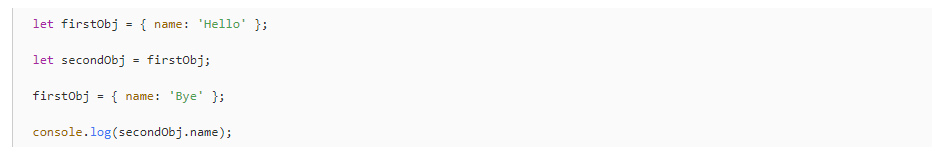

# Middle
## Общие вопросы

1. [Расскажите о пирамиде тестирования.](https://tlroadmap.io/roles/technical-lead/product-quality/testing/test-pyramid.html)
2. [ Какие типы автоматизированных тестов представился случай писать? Какие библиотеки при этом использовали? Какие инструменты предпочитаете и почему?](https://lebedev.of.by/piramida-tests/)
3. [Что такое unit-тесты? Какое место в пирамиде тестирования занимают unit-тесты?](https://skillbox.ru/media/code/chto-takoe-unit-testy/)
4. [Что такое code coverage? Обязательно ли 100% покрытие тестами кода?](https://ask-dev.ru/info/39675/what-is-code-coverage-and-how-do-you-measure-it)
5. [Как запретить браузеру отдавать кэш на HTTP-запрос?](https://qna.habr.com/q/258883)
6. [Что такое XSS (Cross-Site Scripting)?](https://habr.com/ru/post/511318/)
7. [Расскажите о паттернах Observer, Pub/Sub. Какая между ними разница? Приведите примеры реализации этих паттернов в известных фреймворках/библиотеках/браузерных API.](https://webdevblog.ru/v-chem-raznica-mezhdu-shablonami-observer-i-pub-sub/)
8. [С какой целью может быть использован event listener события fetch self.addEventListener('fetch', event=>{})?](https://developer.mozilla.org/ru/docs/Web/API/FetchEvent)
9. [Что такое Event loop и как он работает? Расскажите о микрозадачах и макрозадачах.](https://habr.com/ru/post/461401/)

## Ядро JS

10. [Какие типы данных бывают в JavaScript? Каков будет результат выполнения кода (Hello) ?](https://learn.javascript.ru/types)

11. [Что такое temporal dead zone?](https://jsinthebits.com/what-is-the-temporal-dead-zone-e41369d4/#:~:text=Объяснение%20Temporal%20Dead%20Zone,видимости%20до%20момента%20их%20объявления.)
12. [Как работает boxing/unboxing в JavaScript?](https://qna.habr.com/q/495724)
13. [В чем разница между оператором in и методом hasOwnProperty?](https://russianblogs.com/article/22711382795/)
14. [Опишите, с помощью чего в JS реализуются такие ООП-парадигмы как инкапсуляция, полиморфизм, абстракция?](https://frontend-stuff.com/blog/object-oriented-programming/)
15. [Что такое прототип? Как работает прототипное подражание в JS? Объясните работу кода.](https://learn.javascript.ru/prototype-inheritance)

16. [Какая разница между композицией и наследованием?](https://webdevblog.ru/prosto-o-kompozicii-agregacii-i-associacii-v-javascript/)
17. [Почему не следует использовать конструкторы типа new String?](https://learn.javascript.ru/constructor-new)
18. [Расскажите о базовом устройстве и механизме работы Event loop.](https://medium.com/devschacht/javascript-eventloop-explained-f2dcf84e36ee)
19. [Что такое записи (records) и кортежи (tuples)? Чем они отличаются от обычных объектов?](https://habr.com/ru/post/504092/)
20. [Какие отличия в поведении ES5 функции-конструктора и класса ES2015?](https://www.cyberforum.ru/javascript/thread2172890.html)
21. [Как реализовать паттерн «Модуль»?](https://habr.com/ru/company/ruvds/blog/419997/)
22. [Почему typeof null возвращает объект?](https://overcoder.net/q/1659198/почему-typeof-null-возвращает-объект-но-вы-не-можете-назначить-ему-свойства)
23. [Что такое приведение (преобразование) типов в JS?](https://learn.javascript.ru/type-conversions)
24. Что такое явное и неявное приведение (преобразование) типов данных в JS? Как происходит преобразование типов в следующих примерах:

25. [Что такое Garbage Collector?](https://learn.javascript.ru/garbage-collection)
26. [Опишите основные принципы работы сборщика мусора в JS-движках (engines).](https://medium.com/devschacht/сборщик-мусора-в-v8-иллюстрированное-руководство-d3e496a4d378)
27. [Опишите назначения и принципы работы с коллекциями WeakMap и WeakSet? Чем они отличаются от коллекций Map и Set соответственно?](https://learn.javascript.ru/weakmap-weakset)
28. [Чем отличается Observable от Promise?](https://nicecoding.ru/v-chem-otlichie-observable-ot-promise.html#:~:text=Если%20результат%20HTTP-запроса%20на,результат%20вам%20уже%20не%20требуется.)
29. [Что такое Promise? Назовите порядок выполнения then и catch в цепочке .](https://learn.javascript.ru/promise)

30. [Расскажите о последовательном и параллельном выполнении асинхронных функций. В чем разница между Promise.all() и Promise.allSettled()?](https://metanit.com/web/javascript/17.5.php)
31. [Что такое дескрипторы свойств объектов? Расскажите об их практическом применении.](https://learn.javascript.ru/property-descriptors)
32. [Назовите несколько способов создания постоянного объекта в JavaScript.](https://dmitrytinitilov.gitbooks.io/strange-javascript/content/oop/objects.html)
33. [Как создать свойство объекта, которое нельзя будет изменить?](https://know-online.com/post/javascript-zapretit-izmenyat-svoistva-objecta#:~:text=Для%20этого%20можно%20использовать%20метод,свойства%2C%20которое%20нельзя%20изменить%20Object.)
34. [Зачем нужен конструктор Proxy? Приведите пример использования.](https://learn.javascript.ru/proxy)
35. [Что такое ArrayBuffer? В чем разница между Uint32Array и Float32Array? Каков результат выполнения кода?](https://learn.javascript.ru/arraybuffer-binary-arrays)

36. Каков будет результат сравнения?
    

37. [Расскажите о генераторах и итераторах.](https://developer.mozilla.org/ru/docs/Web/JavaScript/Guide/Iterators_and_Generators)
38. Объясните, что делает приведенный код:

39. [Расскажите о типе данных Symbol и его практическом применении. Как перевести число из  10-разрядной системы в 16(2,8)-разрядную систему счисления?](https://learn.javascript.ru/symbol)

## Функции

40. [Объясните, что означает currying. Приведите пример использования на практике.](https://learn.javascript.ru/currying-partials)
41. [Приведите пример с мемоизацией. Когда следует применять эту технику?](https://habr.com/ru/company/ruvds/blog/332384/)
42. [Что такое чейнинг функций? Напишите пример с использованием этого подхода.](https://learn.javascript.ru/task/chain-calls)
43. [В чем разница между function и arrow function?Каков будет результат выполнения кода ?](https://vc.ru/dev/133379-5-otlichiy-mezhdu-obychnymi-i-strelochnymi-funkciyami)

## Front-end

44. [В чем принципиальная разница между событиями mouseleave и mouseout?](https://russianblogs.com/article/28661403159/)
45. [В каком порядке обрабатываются пользовательские события в DOM (click, mouseover и т.д.)? FIFO или LIFO?](https://learn.javascript.ru/events-and-timing-depth)
46. ​​[Что такое Event bubbling и Event capturing?](https://webdevblog.ru/event-bubbling-i-event-capturing-v-javascript/)
47. [Сравните методы объекта event stopPropagation и stopImmediateProparation.](https://stepansuvorov.com/blog/2013/05/отличие-preventdefault-stoppropagation-и-stopimmediatepropagation/)
48. [Каковы подходы к оптимизации производительности вебстраницы?](https://proglib.io/p/web-optimization)
49. [Как реализован механизм same-origin policy в браузере? На какие браузерные API он распространяется?](https://developer.mozilla.org/ru/docs/Web/Security/Same-origin_policy)
50. [Назовите способы хранения данных в браузере. Сравните их.](https://webformyself.com/varianty-xraneniya-dannyx-v-brauzere-v-2021-godu/)
51. [Web worker'ы. Опишите особенности передачи данных между worker'ами и основным потоком между разделенными worker'ами.](https://developer.mozilla.org/ru/docs/Web/API/Web_Workers_API/Using_web_workers)
51. [Что такое Transferable-объекты?](https://habr.com/ru/post/337492/)
52. [Расскажите о способах оптимизации выполнения ресурсоемких операций JS для улучшения производительности рендеринга контента на странице.](https://habr.com/ru/company/hh/blog/513940/)
53. [Почему ResizeObserver вызывает события изменения размера до воспроизведения элемента, а не после?](https://habr.com/ru/post/487146/)
54. [Расскажите, как вы понимаете Web Accessibility?](https://developer.mozilla.org/ru/docs/Learn/Accessibility/What_is_accessibility)
55. Опишите метод сотворения функционала, обеспечивающего чтение содержимого .txt-файла при перетаскивании его из файловой системы в окно браузера.
56. [Что такое Virtual DOM?](https://habr.com/ru/post/256965/)

## Верстка

57. [Объясните разницу между единицами измерения px, em, rem.](https://learn.javascript.ru/css-units)
58. [Зачем нужны CSS-переменные? Приведите несколько примеров использования.](https://developer.mozilla.org/ru/docs/Web/CSS/Using_CSS_custom_properties)
59. [Что произойдет при добавлении следующего селектора ? * { box-sizing: border-box; } ](https://developer.mozilla.org/ru/docs/Web/CSS/box-sizing)
60. [Как адаптировать страницу печати?](https://vc.ru/flood/23660-print-style-sheets)
61. [Опишите особенности кастомизации стилей обычных частей форм.](https://techrocks.ru/2020/03/25/how-to-style-forms-with-css/)
62. [Что такое progressive рендеринг? Какие подходы используются?](https://overcoder.net/q/69980/что-такое-прогрессивный-рендеринг)
63. [Назовите несколько способов реализации lazy-loading медиаресурсов на странице.](https://siteclinic.ru/blog/internal-optimization/lazy-load/)
64. [Назовите популярные шаблонизаторы для фронтенд-разработки. Опишите особенности их использования.](https://habr.com/ru/post/219873/)
65. [Назовите популярные CSS-методологии и их отличия.](https://webformyself.com/css-metodologii-css-bem-smacss-ecss/)
66. [Как работает CSS Grid?](https://medium.com/@stasonmars/вёрстка-на-grid-в-css-полное-руководство-и-справочник-220508316f8b)
67. [Какие форматы изображения поддерживают анимацию?](https://habr.com/ru/company/io/blog/261083/)
68. [Как отследить прогресс / окончание CSS @keyframes анимаций или плавных переходов, реализуемых с помощью transition, в JS?](https://www.cyberforum.ru/javascript-beginners/thread2642234.html)
69. [Какие свойства CSS могут быть обработаны непосредственно через GPU? Что такое композитные слои и почему их обилие может привести к аварийному завершению работы браузера на мобильных устройствах?](https://habr.com/ru/company/odnoklassniki/blog/313978/)
70. [Как перееиспользовать инлайн-элементы SVG на странице?](http://css.yoksel.ru/svg-groups-use/)
71. [Опишите способы оптимизации файлов SVG.](https://webformyself.com/optimizaciya-svg-dlya-veb/)
72. [Как реализовать иконочный шрифт из определенного набора SVG-файлов?](https://вебджем.рф/raznoe/ikonochnye-shrifty-dlya-sajta-generaciya-i-podklyuchenie-shrifta-ikonok-k-stranice-sajta-kak-ispolzovat-ikonki-shrifta-na-stranice-sajta.html)
73. [Что такое ложное жирное или ложное курсивное (Faux) начертание шрифтов?](https://css-live.ru/articles/skazhem-net-lozhnomu-zhirnomu.html)
74. [Что такое #shadow-root в инспекторе HTML-страницы?](http://webdiz.com.ua/shadow-dom-chto-yeto-takoe/)
75. [Зачем нужны Custom Elements?](https://learn.javascript.ru/custom-elements#:~:text=Мы%20можем%20создавать%20пользовательские%20HTML,наравне%20со%20встроенными%20HTML-элементами.)
76. [Почему удаление лишних символов пробелов/символов переноса в HTML не отражается на конечной производительности загрузки страницы?](https://zametkinapolyah.ru/verstka-sajtov/probelnye-simvoly-v-html-tabulyaciya-v-html-nerazryvnyj-probel-v-html-perenos-stroki-v-html.html)
77. [Что такое контекст отображения canvas? Какие типы контекста для рендеринга двумерной и трехмерной графики?](https://developer.mozilla.org/ru/docs/Web/API/Canvas_API/Tutorial/Basic_usage)

## Angular

78. Как работает Dependency injection? Зачем это нужно? Расскажите об использовании кастомных инжекторов.
79. Что такое zone.js? Зачем Angular использует зоны? С какой целью можно использовать NgZone-сервис?
80. Как работает Change detection? Как оптимизировать компонент с помощью схем Change detection? Какие еще приемы для оптимизации рендеринга (связаны с Change detection)?
81. Как выполнить конфигурацию HTTP-сервиса? Зачем она нужна? Обработка HTTP-ошибок?
82. Каковы подходы к организации работы с данными?
83. Как подготовить сборник к деплою?
84. Что такое NgRx? Когда следует использовать?
85. В каких вариантах лучше употреблять Renderer-сервис заместо нативных способов? И наоборот?
86. Как работают и зачем нужны резолверы? Как получить данные, загруженные резолверами?
87. Как работают и зачем нужны динамические компоненты? Приведите примеры их целесообразного использования.
88. Какая разница между @ViewChild и @ContentChild?
89. Что делает код и как иначе можно увязать класс компонента с переменной?
@HostBinding('class.valid') isValid; 
90. Как можно кэшировать данные, используя сервисы или RxJS?
91. Что такое асинхронная валидация форм? Когда используется и как реализуется?
92. Зачем нужна forRoot-функция модуля?
93. Какова разница между декларированием и экспортом компонента из модуля?
94. Почему плохо «провайдировать» сервис по shared-модулю в lazy-loaded модуль? (Вопрос о scope модулях.)
95. Что такое ::ng-deep и для чего используется?
96. Какие тесты можно запустить для программы Angular? Какие инструменты используют для тестирования Angular-программы?
97. Как протестировать API-сервис?

## React 

98. Что такое JSX? Что лежит в его базе?
99. Как работает алгоритм Virtual DOM?
100. Для чего нужно свойство key при рендеринге списков?
101. В чем разница между функциональными и классовыми компонентами?
102. Зачем и когда нужно передавать props в super() при использовании классовых компонентов?
103. Почему необходимо использовать setState() для обновления внутреннего состояния компонента?
104. В чем принцип «подъема состояния»?
105. Какие библиотеки менеджмента состояния React-приложения вы знаете? Для чего они?
106. Когда следует использовать Redux? Какие альтернативы?
107. Redux vs Mobx?
108. Расскажите о базовом принципе работы React Hooks.
109. В чем разница между createRef и useRef?
110. Когда следует использовать React refs? Когда не стоит?
111. Какие недостатки библиотеки React видите?
112. Какие паттерны используете вместе с React?
113. Как вы относитесь к типизации вместе с React?
114. Как построить хорошую архитектуру React-проекта?
115. Оптимизация React-приложений? Как измерить производительность программы?
116. Можно ли приложение React встроить в другое приложение React?

## Back-end

117. [Почему Node.js однопоточный, а не многопоточный?](https://overcoder.net/q/7334/почему-nodejs-однопоточный)
118. [Что такое event driven development?](https://www.valentinog.com/blog/event/)
119. [Сравните методы fork() и spawn().](https://bestprogrammer.ru/izuchenie/raznitsa-mezhdu-metodami-spawn-i-fork-v-node-js)
120. [Расскажите о Node.js используемых фреймворках. Какая между ними разница?](https://proglib.io/p/luchshie-freymvorki-node-js-v-2021-godu-2021-04-14)
121. Опишите словами код эндпоинта, который должен сохранить из клиента файл размером 4 гигабайта и положить его на S3 или другой CDN.
122. [Что такое микросервисы, для чего их используют?](https://apptractor.ru/info/articles/microservices.html#:~:text=Gartner%2C%20глобальная%20исследовательская%20и%20консалтинговая,Эта%20статья%20посвящена%20микросервисам.)
123. [В каких случаях вы выбрали бы монолит, а в каких — микросервисы?](https://habr.com/ru/company/oleg-bunin/blog/541010/)
124. Как понять, что приложение в какой-то момент работает исправно?
125. Как понять, что приложение за последние три дня работало исправно?
126. [Как происходит проверка правильности пароля при использовании bcrypt?](https://overcoder.net/q/1471136/как-проверить-правильность-пароля-bcrypt)
127. [Что такое JWT?](https://habr.com/ru/post/340146/)
128. Джуниор послал код на ревью. Что здесь не так ли? Как поправить?

## Базы данных

129. [Что такое Redis и зачем его используют?](https://aws.amazon.com/ru/redis/#:~:text=Redis%20позволяет%20писать%20меньше%20строк,могут%20использовать%20простую%20структуру%20команд.)
130. [Какие базы данных использовались? Какая разница между SQL и NoSQL?](https://habr.com/ru/company/ruvds/blog/324936/)
131. Для двух таблиц – комментарии и пользователи – напишите запрос, который выбирает последние три комментария для каждого пользователя.
132. [Я, как заказчик, прошу выбрать вас базу данных для нового проекта. Ваши действия?](https://vc.ru/dev/289019-kak-biznesu-vybrat-bazu-dannyh-pod-svoy-proekt-sravnivaem-on-premise-i-upravlyaemuyu-bd)

## Инструменты и прочее

133. [Зачем нужен package-lock.json?](https://ru.stackoverflow.com/questions/918655/Для-чего-нужен-package-lock-json)
134. [В чем разница между npm install и npm ci?](https://stackoverflow.com/questions/52499617/what-is-the-difference-between-npm-install-and-npm-ci)
135. [Зачем нужны бандлеры?](https://habr.com/ru/company/vk/blog/340922/)
136. [Расскажите о модульном подключении скриптов. Приведите пример использования загрузчиков/бандлеров модулей.](https://learn.javascript.ru/modules-intro)
137. [В чем разница между git merge и git rebase?](https://habr.com/ru/post/432420/)
138. [Что такое staging area в git?](https://ru.stackoverflow.com/questions/153301/Зачем-нужна-staging-area-index-в-git)
139. [Опишите процесс code review. Назовите основные правила, способы разрешения конфликтов и споров во время его проведения.](https://habr.com/ru/post/473308/)

## Практические задания

140. Напишите функцию Sleep (ms), которая приостанавливает выполнение async-функции на заданный промежуток времени.
141. Реализуйте один из методов массива (например, splice).
142. Напишите функцию RegExp для нахождения всех HTML-ссылок в строке.
143. Реализуйте функцию, которая выполняет callback для всех элементов определенной ветви DOM-деревья.
144. Реализуйте таблицу с виртуальным скролом.
145. Реализуйте функцию преобразования URL query строки в JSON.

146. Реализуйте функцию нахождения пересечения двух массивов.

  

147. Реализуйте функцию/класс для генерации HTML.
   
 

148. Если есть проект с ограниченными сроками и некритической производительностью, чем будете руководствоваться при выборе библиотек, подходов? Или все же будете обращать внимание на производительность? Или наоборот: сроки нелимитированы, производительность важна. Ваши действия?

